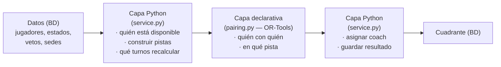

# Cómo se organizan los criterios en el código (sin ser un `if` infinito)

> Documento para PM técnico. Explica **cómo** el motor de G Tenis decide los
> emparejamientos: qué es declarativo (el "solver") y qué es procedural (Python
> normal), y dónde vive cada regla del PRD. No necesitas saber matemáticas.

---

## TL;DR

El emparejamiento **no** se programa diciendo "haz esto, luego esto, luego si pasa
esto otro…". Se programa **declarando las reglas que deben cumplirse** y dejando
que un motor de optimización (Google OR-Tools) encuentre la mejor combinación que
las respeta todas a la vez.

La analogía exacta es un **solucionador de Sudoku**:
- En un Sudoku tú no escribes `if` para cada casilla. Escribes **las reglas**
  ("cada fila/columna/cuadro sin repetir") y el solucionador rellena el tablero.
- Aquí igual: declaramos "dos jugadores en la misma pista deben ser de divisiones
  vecinas", "los vetados nunca juntos", "2 por pista"… y el solver coloca a los
  ~50 jugadores en pistas y turnos cumpliéndolo todo.

Un `if` encadenado no sirve porque las decisiones **dependen unas de otras**: a
quién pongo en la pista 1 cambia quién puede ir a la 2, a la 3, etc. Eso es
combinatorio, no secuencial.

---

## 1. El problema con el enfoque "todo `if`"

Imagina hacerlo a mano:

```python
# ENFOQUE INGENUO (no lo hacemos así)
for jugador in jugadores:
    for pista in pistas:
        if pista.libre() and divisiones_compatibles(jugador, pista) \
           and not hay_rencilla(jugador, pista) and cabe(jugador, pista) and ...:
            pista.añadir(jugador)
            break
```

Esto falla por tres motivos:

1. **Orden = lotería.** El primer jugador "ocupa" la mejor pista y deja sin
   opciones a los siguientes. El resultado depende del orden en que recorres, no
   de qué es óptimo.
2. **No retrocede.** Si en el jugador nº 40 te das cuenta de que no cabe nadie,
   un `if` no "deshace" las 39 decisiones anteriores. Un solver sí explora
   alternativas.
3. **Inmantenible.** Cada regla nueva del PRD = otro `and` en una condición ya
   monstruosa, y los conflictos entre reglas hay que resolverlos a mano.

---

## 2. El enfoque real: declarar reglas, no pasos

Todo el núcleo está en [`backend/engine/pairing.py`](../backend/engine/pairing.py).
Tiene **tres bloques**, siempre los mismos:

### a) Variables — las "casillas" que el solver decide

```python
# ¿Está el jugador p en la pista c?  (un sí/no por cada combinación)
x = {(p.id, c.id): model.NewBoolVar(...) for p in players for c in courts}
```

Nosotros no les damos valor: **el solver decide** cuáles son "sí".

### b) Restricciones DURAS — lo que jamás se puede romper

Se "declaran" con `model.Add(...)`. Ejemplos reales del código:

```python
# Cada jugador como mucho en una pista
model.Add(sum(x[p.id, c.id] for c in courts) <= 1)

# Una pista usada lleva entre 2 y su capacidad (nada de medias pistas)
model.Add(occ >= 2 * used[c.id])
model.Add(occ <= c.capacity * used[c.id])

# Pareja incompatible: nunca en la misma pista
for a, b in incompatible:
    for c in courts:
        model.Add(x[a, c.id] + x[b, c.id] <= 1)
```

Fíjate: **no hay `if` que decida la asignación**. Solo afirmaciones de lo que
tiene que ser verdad. El solver se encarga de encontrar una combinación que las
cumpla.

> "Incompatible" se calcula una vez en `_incompatible()`: dos jugadores lo son si
> hay **rencilla** (veto) **o** si sus divisiones se diferencian en más de 1
> (regla de vecindad N±1). Dos reglas del PRD colapsadas en un único criterio.

### c) Restricciones BLANDAS — preferencias con prioridad (peso)

No todo es "obligatorio". Hay cosas que "es mejor evitar pero no a cualquier
precio". Eso se expresa como una **función objetivo** que el solver maximiza:

```python
model.Maximize(
      1000 * (jugadores_asignados)     # prioridad máxima: que jueguen todos
    -    5 * (pistas_satélite_usadas)  # mejor llenar la sede central primero
    -   10 * (parejas_repetidas)       # antirrepetición / rotación
)
```

El **número (peso) ES la prioridad**. Como "asignar" pesa 1000 y "repetir pareja"
pesa 10, el solver **antes repite una pareja que dejar a alguien sin jugar**. Ahí
está, literalmente, la jerarquía de criterios del PRD: en los pesos, no en el
orden de unos `if`.

---

## 3. Dónde vive cada criterio del PRD

| Criterio (PRD) | Tipo | Dónde | Cómo se expresa |
|---|---|---|---|
| §4.1 Vecindad de división (N±1) | **Dura** | `pairing._incompatible` | par prohibido si \|díf división\| > 1 |
| §4.2 Rencillas (veto cruzado) | **Dura** | `pairing._incompatible` + modelo `Rencilla` | par prohibido si hay veto |
| §05 Capacidad 2–4 / no medias pistas | **Dura** | `pairing.solve_pairing` | `2 ≤ ocupación ≤ capacidad` |
| §05 Desbordamiento a satélites | **Blanda** | objetivo (`-5 × satélite`) | penaliza usar satélite → se usan solo si hace falta |
| §4.3 Antirrepetición / rotación | **Blanda** | objetivo (`-10 × repetición`) + `service._recent_partners` | penaliza repetir pareja vista esta semana |
| §03 Estados (lesión, torneo…) | **Filtro previo** | `service._available_players` | excluye del cálculo a quien no está disponible |
| §4.4 Contrato de patrocinio | **Preferencia** | `service._assign_coaches` | orden de preferencia al elegir coach |
| §02 Regenerar solo la tarde | **Alcance** | `service.generate(bloques=...)` | recalcula únicamente esos turnos |

Tres "tipos" distintos, y eso es la clave del diseño 👇

---

## 4. Las dos capas: solver vs Python normal

No todo es solver. Hay **dos clases de lógica** y cada una va donde le toca:



- **Lógica combinatoria → declarativa (el solver).** "¿Quién va con quién en qué
  pista, cumpliendo todo a la vez?" Eso es lo que un `if` no sabe hacer y el
  solver sí. Vive en [`pairing.py`](../backend/engine/pairing.py).

- **Lógica secuencial → Python normal (`if`/`for` de toda la vida).** Cosas que
  **sí** son pasos ordenados y no son combinatorias:
  - *Quién entra al cálculo* (`_available_players`): filtra ausencias/lesiones
    antes de llamar al solver.
  - *Qué coach va a cada pista* (`_assign_coaches`): un orden de preferencia
    sencillo — patrocinador → entrenador responsable → el menos cargado
    (rotación). Aquí **sí hay `if`**, y está bien, porque es una decisión
    secuencial, no un puzzle global.
  - *Qué recalcular* (`generate(bloques=["TARDE"])`): la regeneración de tarde
    del §02 es simplemente "vuelve a resolver solo estos turnos y no toques la
    mañana".

Vive en [`service.py`](../backend/engine/service.py).

> Resumen mental: **el solver decide el puzzle; Python prepara los datos, elige
> coach y orquesta.** Lo difícil (el puzzle) es declarativo; lo lineal sigue
> siendo código normal.

---

## 5. ¿Y cuando dos reglas chocan? (resolución de conflictos)

El PRD pedía una "jerarquía". No se programa con `if` anidados: se programa con
**los pesos del objetivo**. Ejemplo real:

- Quedan 33 jugadores disponibles pero solo 32 plazas.
- "Que jueguen todos" pesa 1000; "no repetir pareja" pesa 10.
- El solver, automáticamente, prefiere **meter a todos aun repitiendo una pareja**
  antes que dejar a uno fuera. Y si dos soluciones empatan en "todos juegan",
  elige la que **menos** repite.

Cambiar la prioridad de un criterio = **cambiar un número**. Eso es muchísimo más
seguro y revisable que reordenar condiciones.

---

## 6. Cómo se añade o cambia una regla (la ventaja real)

Esto es lo que importa para mantener el producto vivo:

- **Nueva regla dura** (ej.: "un jugador no puede ir 2 días seguidos a la misma
  pista") → se añade **un bloque** `model.Add(...)`. No se toca nada más.
- **Nueva preferencia** (ej.: "intenta que cada jugador rote de coach") → se suma
  **un término** al objetivo con su peso.
- **Cambiar prioridades** → se ajusta **un número**.
- **Cambiar quién es elegible** (estados nuevos) → se toca solo el filtro
  `_available_players`.

Cada regla queda **aislada y con nombre**. En un `if` gigante, cada cambio
arriesga romper los demás criterios; aquí no.

---

## 7. Por qué este diseño (para defender la decisión)

| | `if` encadenado | Solver declarativo |
|---|---|---|
| Resultado | depende del orden | óptimo según prioridades |
| Conflictos entre reglas | a mano, frágil | automático (pesos) |
| Añadir un criterio | otro `and`, riesgo global | un bloque aislado |
| Retroceder / explorar | no | sí |
| "Por qué salió esto" | difícil | trazable (reglas + pesos) |
| Tamaño del problema | crece fatal | ~50 jugadores = trivial para OR-Tools |

---

## Punteros al código

- Motor puro (variables, reglas duras, objetivo): [`backend/engine/pairing.py`](../backend/engine/pairing.py)
- Orquestación (disponibilidad, coach, alcance, persistencia): [`backend/engine/service.py`](../backend/engine/service.py)
- Estados que excluyen del cálculo: [`backend/scheduling/models.py`](../backend/scheduling/models.py) (`ESTADOS_EXCLUYENTES`)
- Tests que fijan el comportamiento de las reglas: [`backend/engine/tests.py`](../backend/engine/tests.py)
